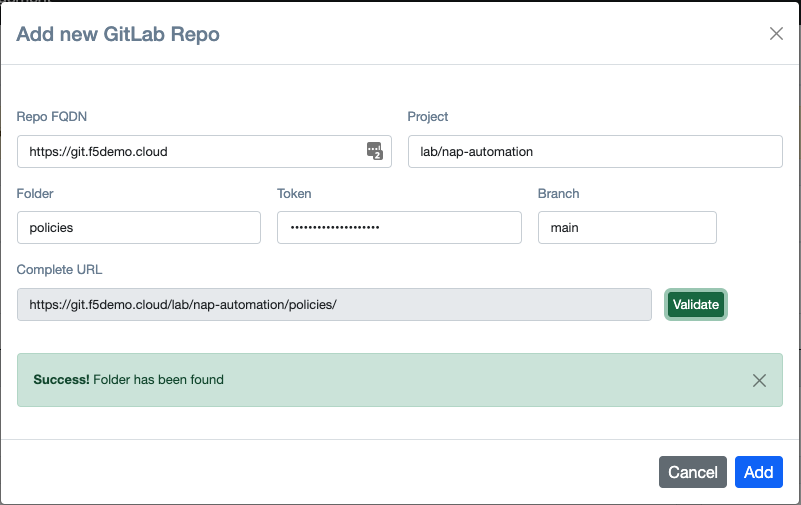

# NAP - False Positive Management
> This is a project makes it easier for SecOps teams to manage False Positives and do the required configuration changes to the NGINX App Protect policies by providing a UI.

## How does it works
NAP-FPM UI provides visibility to SecOps teams, for the different violations that exist on a SupportID and also gives the option to modify the NAP policy  with few simple clicks.


## Table of Contents

- [Installation](#installation)
- [Configuration](#configuration)
- [Support](#support)

---

## Installation
In the following section we will describe how to deploy all the required components in order for **NAP-FPM** to work successfully. 


### Step 1. Deploy Elasticsearch to store NAP events
**NAP-FPM** provides doesn't provide any Datastore to save *NGINX App Protect* events. For storing the NAP events we rely on Elasticsearch. Please refer to the <a href="https://github.com/skenderidis/nap-dashboard"> NAP-Dashboard </a> project that provides all the details on how to deploy `Elasticsearch`, `Logstash` and `Grafana` for *NGINX App Protect*.

### Step2. Configure GitLab 
The source of truth for the *NGINX App Protect* policies should always be GitLab. The GitLab repository should hold the latest version of the **WAF** policies that have been deployed. If you require information on how to install a self-managed GitLab instance, please refer to the following link. https://about.gitlab.com/install/

Once GitLab is up and running, **NAP-FPM** will use GitLab's API to pull and push changes made on the *NGINX App Protect* policies. In order for **NAP-FPM** to have permission to do so, we need to create a GITLAB Access-Token. This can be done under `Settings`->`Access Tokens` for the repository that holds the policies. The token needs to have read/write access to the repository.

<p align="center">
       
</p>

>**Note:**  Please keep the Access token as we will need to use it when we configure **NAP-FPM**.

### Step 3. Deploy NAP-FPM docker image.
We provide 2 options on how to deploy the NAP-FPM as a docker container.

**First option** is to use the docker image that is already configured and pushed to DockerHub. To deploy this image simply run the following on your Docker station.
1. Create a Volume for persistent storage. 
  ```
  docker volume create fpm-volume
  ```
2. Run the Docker instance. 
  ```
  docker run -d -p 80:80 -v fpm-volume:/etc/fpm  skenderidis/nap-fpm:latest
  ```
Ready to connect.

**Second option** is to use build the image based on the dockerfile that is provided on this GitHub repo.
  1. Clone the repo to your docker station and switch the working directory to be `nap-false-positive`.
  ```
  git clone https://github.com/skenderidis/nap-false-positive.git
  cd nap-false-positive
  ```
  2.  Create a Volume for persistent storage. 
  ```
  docker volume create fpm-volume
  ```
  3. Build the docker image.
  ```
  docker build -t nap-fpm:latest .
  ```
  4. Run the image that you just built.
  ```
  docker run -d -p 80:80 -v fpm-volume:/etc/fpm  skenderidis/nap-fpm:latest
  ```

> Note: If you require **NAP-FPM** to run inside K8s please open a GitHub issue.


## Configuration
In this section we will take you through the steps on how to do the basic configuration of **NAP-FPM**.

Open your browser and connect to the IP address of the running container  

<p align="center">
       
</p>

Log in with the default credentials (admin/admin) and you should be redirect you to the `settings.php` page.

<p align="center">
       
</p>

> **Note:** You should see 2 warnings at the top of the page. This is due to the fact that neither GitLab nor Elastic datasources have been configured

Enter the URL for Elastic Datasource.

<p align="center">
       
</p>

> **Note:** After you have validate the Datasource URL, you should be able to save the configuration. 

Save Elastic Datasource. 

<p align="center">
       
</p>

> **Note:** You will receive a message that the Datasource configuration has been saved.


Click the `Add new` button and enter the GitLab details. 

<p align="center">

</p>

> **Note:** It is important to enter the Foder/Path that the NAP Policies are saved.
> **Note2:** After you have validate the Datasource URL, you should be able to save the configuration. 

Save the GitLab Repo. 

<p align="center">
       
</p>

> **Note:** You will receive a message that the Datasource configuration has been saved.

Once all the above steps are completed you can go to the `Violations` tab. You should be able to retrieve the NAP events from and modify the configuration accordingly.


## Integration with Grafana
We are able to Grafana with NAP-FPM, so that the user can click the Support ID on Grafana and be redirected to NAP-FPM. To achieve this we need to edit the Logs Tab and change the datalink to point to NAP-FPM

<p align="left">
       
</p>

Once you are in edit mode, go to Overrides and change the datalink 

<p align="left">
       
</p>

From:
```
/d/nap-supportid/supportid?var-SupportID=${__value.raw}
```

To:
```
http://<IP-Address>/violation.php?support_id=${__data.fields["Support ID"]}
```

Once the change has been completed, you should be able to select the Support-ID and be automatically redirected to the FPM violations page.

<p align="left">
       
</p>

## Support

For support, please open a GitHub issue. Note, the code in this repository is community supported and is not supported by F5 Networks.
